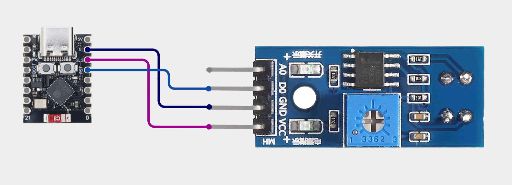
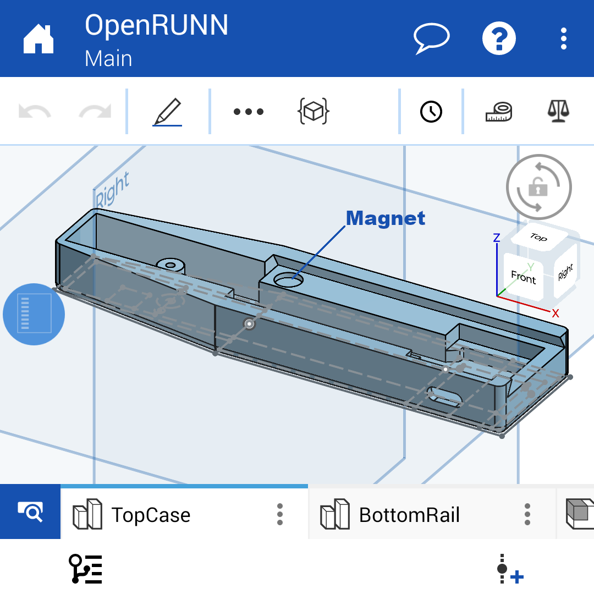
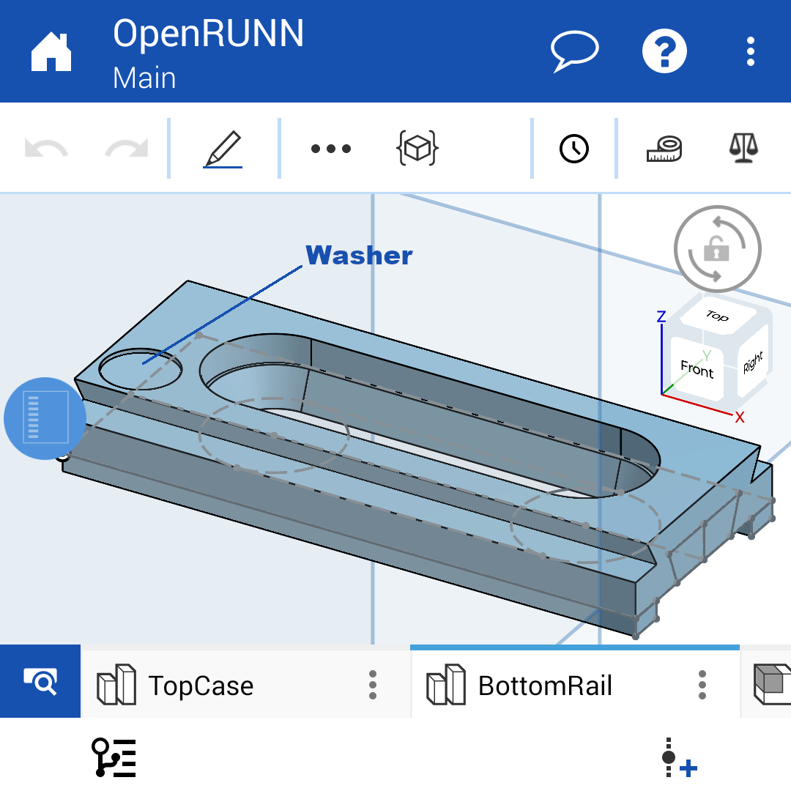
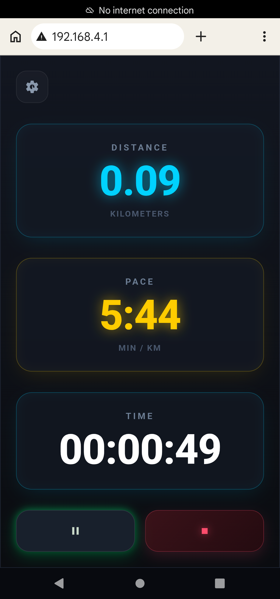

# OpenRUNN

OpenRUNN is an ESP32-C3 treadmill running sensor. It reads pulses from a TCRT5000 optical sensor and exposes speed and distance through the Bluetooth Low Energy Running Speed and Cadence (RSC) service.

## Wiring

Connect the ESP32-C3 to the TCRT5000 module as follows:

- GND to `GND`
- 3.3 V to `VCC`
- GPIO 4 to `DO`
- Leave `AO` disconnected



The circuit is powered through the ESP32-C3 USB connector. The board supplies 3.3 V to the TCRT5000 module, so no separate power supply is required.

####  Important notes:

- Power the TCRT5000 from 3.3 V, not 5 V, so its digital output remains safe for the ESP32-C3 GPIO.
- The ESP32-C3 and sensor must share the same GND connection.
- Disconnect USB power while changing the wiring.
- Adjust the sensor module's potentiometer until `DO` changes state reliably once per belt marker. The module's digital indicator LED can be used while tuning the threshold.
- Position the sensor close enough to the marker for reliable detection, while leaving enough clearance to prevent contact with the moving belt.

## 3D Printed Enclosure (CAD)

The enclosure parts can be 3D printed or modified online:

- **Onshape CAD Project:** [OpenRUNN CAD on Onshape](https://cad.onshape.com/documents/b1faf20878b0b15aca3d2b67/w/d11ab869225999fb49bd0b1a/e/4259dc78c6a26a2227b742bb?renderMode=0&uiState=6aa6a6600716e97083dc4b1e)

### Top Case

Main enclosure housing the ESP32-C3 and TCRT5000 sensor.

- **STL:** [assets/stl/top_case.stl](assets/stl/top_case.stl)
- **STEP:** [assets/stl/top_case.step](assets/stl/top_case.step)



### Bottom Rail

Mounting rail for securing the case to the treadmill frame.

- **STL:** [assets/stl/bottom_rail.stl](assets/stl/bottom_rail.stl)
- **STEP:** [assets/stl/bottom_rail.step](assets/stl/bottom_rail.step)



## Requirements

- Python 3
- A USB connection to an ESP32-C3 DevKitM-1
- macOS, Linux, or Windows

The first build downloads the ESP32 platform, Arduino framework, and other PlatformIO packages automatically.

## Python Virtual Environment

From the project root, create and activate a virtual environment.

### macOS and Linux

```sh
python3 -m venv .venv
source .venv/bin/activate
python -m pip install --upgrade pip
python -m pip install -r requirements.txt
```

### Windows PowerShell

```powershell
py -3 -m venv .venv
.\.venv\Scripts\Activate.ps1
python -m pip install --upgrade pip
python -m pip install -r requirements.txt
```

The virtual environment must be activated before using the `pio` commands below. To leave it, run:

```sh
deactivate
```

## Configure

Measure the distance represented by one valid sensor pulse, in meters, and update `main.cpp`:

```cpp
const float beltLengthMeters = 3.19f;        // Distance per valid sensor pulse
```

After changing this value, build and upload the firmware again.

## Web Dashboard

The ESP32 creates an open Wi-Fi access point named `OpenRUNN`. Connect a phone or computer to that network, then open:

```text
http://192.168.4.1
```



 The dashboard displays session distance, pace, and elapsed time. The ESP32 exposes only current sensor telemetry through `GET /api/status`; Start, Pause, Resume, Stop, and session accumulation are handled locally by JavaScript in the browser.

Session values are not stored on the ESP32. Reloading or closing the dashboard page resets the current browser session.

The editable web sources are located in `assets/web/`. During every PlatformIO build, `scripts/embed_web_assets.py` minifies the HTML, CSS, and JavaScript, compresses them with gzip, and embeds them in the firmware. Generated files remain inside `.pio/` and must not be edited or committed.

### Local Development Server

Run the dashboard locally with a simulated metrics API:

```sh
python scripts/dev_web_server.py
```

Open `http://127.0.0.1:8765`. The server continuously simulates the same `/api/status` telemetry provided by the ESP32, while the browser manages the session controls. The default simulated speed is 10 km/h; change it with:

```sh
python scripts/dev_web_server.py --speed-kph 12.5
```

To test from another device on the same network, bind to all interfaces and open the computer's local IP address from that device:

```sh
python scripts/dev_web_server.py --host 0.0.0.0
```

## Build

Compile the firmware for the ESP32-C3 DevKitM-1:

```sh
pio run --environment esp32-c3-devkitm-1
```

The first build may take longer while PlatformIO downloads the required toolchains and frameworks.

## Upload

Connect the board by USB and upload the firmware:

```sh
pio run --target upload --environment esp32-c3-devkitm-1
```

If PlatformIO does not detect the board automatically, list available serial ports:

```sh
pio device list
```

Then specify the port explicitly:

```sh
pio run --target upload --environment esp32-c3-devkitm-1 --upload-port /dev/cu.usbmodemXXXX
```

Replace `/dev/cu.usbmodemXXXX` with the port reported on your system.

## Serial Monitor

Open the serial monitor at the configured baud rate:

```sh
pio device monitor --environment esp32-c3-devkitm-1 --baud 115200
```

To specify the port explicitly:

```sh
pio device monitor --environment esp32-c3-devkitm-1 --port /dev/cu.usbmodemXXXX --baud 115200
```

The firmware prints startup, Bluetooth connection, disconnection, and RSC measurement messages to the monitor.

## Useful Commands

Clean the build directory:

```sh
pio run --target clean --environment esp32-c3-devkitm-1
```

Build and upload in one command:

```sh
pio run --target upload --environment esp32-c3-devkitm-1
```

## Project Structure

```text
.
|-- assets/
|   |-- images/          # Project images and screenshots
|   |-- stl/             # 3D printable STL and STEP files
|   `-- web/             # Dashboard HTML, CSS, and JavaScript sources
|-- platformio.ini       # PlatformIO project configuration
|-- requirements.txt     # Python dependency for PlatformIO Core
|-- scripts/             # Web asset build scripts
`-- src/
    |-- main.cpp         # Application setup and main loop
    |-- BLE_RSC.cpp/.h   # Bluetooth Low Energy RSC service
    |-- WebDashboard.cpp/.h # Wi-Fi access point and web dashboard
    `-- TCRT5000.cpp/.h  # Optical sensor and pulse measurement
```
